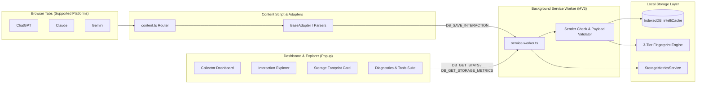
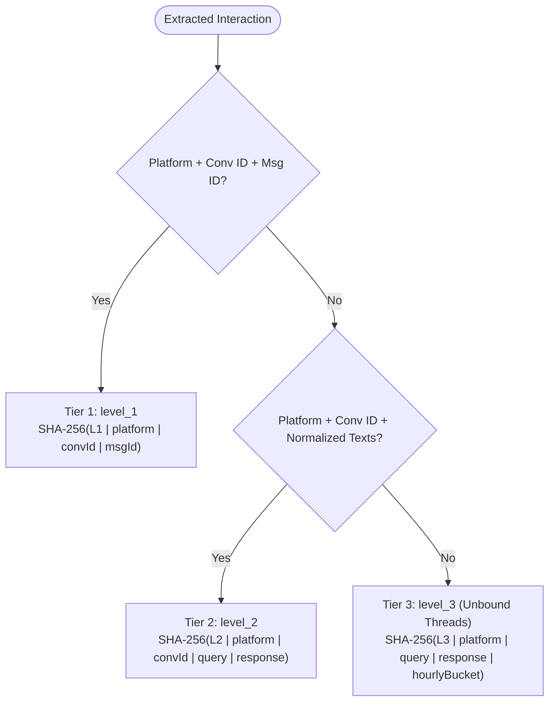

# IntelliCache: Phase 1 Implementation Status Report

**Project Name**: IntelliCache — AI Semantic Response Cache  
**Current Phase**: Phase 1 — Local Data Collection & Local Persistence Layer  
**Architecture Mode**: Privacy-First, Local-Only (Zero cloud dependency, zero external egress)  
**Target Platforms**: ChatGPT (`chatgpt.com`), Claude (`claude.ai`), Google Gemini (`gemini.google.com`)  
**Target Browsers**: Chromium (Google Chrome, Microsoft Edge, Brave) and Mozilla Firefox (Gecko MV3)  
**Build & Test Status**: All 341 tests passing across 30 test suites; TypeScript clean; ESLint clean; dual-target build verified.

---

## 1. Executive Summary

IntelliCache is designed as a local semantic caching engine for generative AI conversations. **Phase 1** focuses on creating the **high-fidelity local data collection and storage layer**.

The extension passively observes, standardizes, deduplicates, and persists user queries and AI assistant responses into a client-side IndexedDB database. It guarantees complete privacy: raw conversations never leave the user's browser, no external network requests are made, and all telemetry/diagnostics are anonymized.



---

## 2. Core Subsystems Implemented

### 2.1 Multi-Platform Collection & Parsers

All platform adapters extend a centralized [`BaseAdapter`](../src/shared/base-adapter.ts) class and consume pure functional utilities from [`parser-utils.ts`](../src/platforms/shared/parser-utils.ts).

1. **ChatGPT Collector** ([`ChatGPTAdapter`](../src/platforms/chatgpt/adapter.ts), [`chatgpt/parser.ts`](../src/platforms/chatgpt/parser.ts)):
   - Monitors `article[data-testid^="conversation-turn-"]` and role-specific DOM nodes.
   - Detects active streaming via stop buttons and streaming cursors (`.result-streaming`), deferring capture until generation completes.
   - Preserves markdown code fences and language annotations while stripping feedback buttons and copy actions.
   - Handles SPA transitions directly through mutation callbacks.

2. **Claude Collector** ([`ClaudeAdapter`](../src/platforms/claude/adapter.ts), [`claude/parser.ts`](../src/platforms/claude/parser.ts)):
   - Identifies human turns via `[data-testid="user-message"]` and assistant turns via `[data-testid="assistant-message"]`.
   - Employs [`NavigationWatcher`](../src/shared/navigation-watcher.ts) (combining `popstate` events with interval polling) to reliably catch `history.pushState` navigation.
   - Manages transitions from `/new` chats to assigned conversation UUIDs (`/chat/{id}`) by buffering pending turns and backfilling metadata.

3. **Gemini Collector** ([`GeminiAdapter`](../src/platforms/gemini/adapter.ts), [`gemini/parser.ts`](../src/platforms/gemini/parser.ts)):
   - Tailored for Google Gemini's custom elements: `<user-query>` and `<model-response>`.
   - Filters out thought/reasoning blocks, transient animation spinners, and interactive suggestion chips.
   - Emits structured DOM diagnostic logs for turn discovery and pairing validation.

---

### 2.2 Deterministic Deduplication Engine

To eliminate duplicate records while accommodating dynamic conversation states, IntelliCache implements a **3-tier hierarchical SHA-256 fingerprinting strategy** ([`fingerprint.ts`](../src/fingerprint/fingerprint.ts)):



- **Level 1 (`level_1`)**: Used when both conversation ID and platform message IDs are present.
- **Level 2 (`level_2`)**: Used when conversation ID is known but message IDs are omitted or obfuscated.
- **Level 3 (`level_3`)**: Fallback for newly initiated chats lacking a URL ID. Uses UTC hourly buckets (`YYYY-MM-DDTHH`) to bind identical queries issued within the same hour while allowing repeated prompts across different sessions.
- **Text Normalization** ([`normalize.ts`](../src/fingerprint/normalize.ts)): Strips zero-width characters, normalizes Unicode (NFC), unifies CRLF to LF, and collapses multi-spaces.

---

### 2.3 IndexedDB Storage & Metrics Layer

Persistence is managed with **Dexie.js** in [`src/database/`](../src/database/):

- **Database Name**: `intelliCache`
- **Schema Versioning**:
  - **Schema v1**: Baseline object stores `interactions` and `conversations`. Unique index on `&fingerprint`.
  - **Schema v2**: Additive upgrade adding compound indexes `[platform+observed_at]` and `[conversation_id+observed_at]` for $O(\log n)$ filtered recency queries.
- **Repositories**:
  - [`InteractionRepository`](../src/database/repositories/interaction-repository.ts): Enforces 200,000 character maximums, recalculates UTF-8 byte and character metrics server-side, validates incoming fingerprints (64-hex lowercase), and handles transactional upserts.
  - [`ConversationRepository`](../src/database/repositories/conversation-repository.ts): Tracks conversation thread metadata (`first_observed_at`, `last_observed_at`, titles).
- **Storage Metrics Service** ([`storage-metrics.ts`](../src/database/storage-metrics.ts)):
  - Computes logical UTF-8 dataset bytes across all string fields.
  - Reads `navigator.storage.estimate()` (usage and quota) via an injectable provider.
  - Generates query/response/metadata size breakdowns.
  - Formatting via [`storage-format.ts`](../src/shared/storage-format.ts) into binary units (B, KiB, MiB, GiB).

---

### 2.4 Service Worker & Cross-Browser Architecture

Built as a unified **Manifest V3** extension supporting both Chromium and Gecko engines:

1. **Ephemeral Background Worker** ([`service-worker.ts`](../src/background/service-worker.ts)):
   - Stateless dispatcher managing message requests: `PING`, `GET_STATUS`, `CONTENT_SCRIPT_INITIALIZED`, `DB_GET_STATS`, `DB_SAVE_INTERACTION`, `DB_GET_INTERACTION`, `DB_GET_STORAGE_METRICS`, and `DB_GET_INTEGRITY_REPORT`.
   - **Sender Verification**: Validates sender tabs against claimed platform payload to prevent origin spoofing.
   - **Rate Limiting**: Throttles intensive integrity scans to prevent DoS.
2. **Cross-Browser Messaging Bridge** ([`browser.ts`](../src/shared/browser.ts)):
   - Transparently handles Promise-based Firefox messaging (`browser.runtime.sendMessage`) and Chromium callback-based messaging (`chrome.runtime.sendMessage`).
3. **Packaging**:
   - `pnpm build`: Bundles Chrome MV3 to `dist/`.
   - `scripts/build-firefox.mjs`: Transforms manifest for Firefox Gecko MV3 (`background.scripts`, specific Gecko extension ID) outputting to `dist-firefox/`.

---

### 2.5 Popup Dashboard & User Interface

The extension popup ([`index.html`](../src/popup/index.html), [`popup.css`](../src/popup/popup.css), [`popup.ts`](../src/popup/popup.ts)) provides complete visibility into local collection:

| Component                     | Capabilities                                                                                                                                       |
| ----------------------------- | -------------------------------------------------------------------------------------------------------------------------------------------------- |
| **Collector Dashboard**       | Live metrics (total interactions, total conversations, service worker status, database connection health).                                         |
| **Platform Breakdown**        | Platform cards featuring official vector SVGs (ChatGPT rosette, Claude terracotta asterisk, Gemini violet-blue sparkle) with percentage bars.      |
| **Recent Activity**           | Feed showing recent turn snippets, relative timestamps ("2m ago"), and provider badges.                                                            |
| **Interaction Explorer**      | Expandable modal drawer with real-time text search, platform filtering chips, turn IDs, fingerprints, and character counts.                        |
| **Storage Footprint Card**    | Displays estimated dataset size, browser-reported usage/quota, average interaction size, and query/response/metadata split with on-demand refresh. |
| **Diagnostics & Tools Suite** | Action buttons for Service Worker Ping, Database Integrity Audit, Full Dataset JSON Export (with safe blob revocation), and Log Clearing.          |
| **Theme System**              | Toggle between clean accessible light mode and pure-black (`#000000`) dark mode, persisted in `localStorage`.                                      |

---

### 2.6 Privacy, Diagnostics & Safety

- **Privacy Guarantees**: [`DiagnosticLogger`](../src/diagnostics/logger.ts) outputs structured logs in the format `[IntelliCache][<Component>][<Platform>] <message>` but strictly redacts prompts, responses, session tokens, and full URLs. Only lengths, IDs, counts, and timing metrics are logged.
- **In-Memory Instrumentation**: [`DiagnosticStats`](../src/diagnostics/stats.ts) monitors DOM scan throughput, turn pairing rates, deduplication hits, and streaming deferrals without writing to disk.

---

## 3. Project File Tree

```
IntelliCache/
├── dist/                              # Chromium MV3 production bundle
├── dist-firefox/                      # Firefox Gecko MV3 production bundle
├── docs/                              # Project documentation and architectural status reports
│   └── phase-1-status-report.md       # Phase 1 architectural status report
├── scripts/
│   └── build-firefox.mjs              # Automated Firefox packaging pipeline
├── src/
│   ├── background/
│   │   └── service-worker.ts          # Central MV3 background dispatcher & security checks
│   ├── content/
│   │   └── content.ts                 # Tab injection hook and platform adapter bootstrap
│   ├── database/
│   │   ├── db.ts                      # Dexie database singleton & version upgrade rules
│   │   ├── metrics.ts                 # Character and UTF-8 byte calculations
│   │   ├── schema.ts                  # DB_NAME, SCHEMA_V1, SCHEMA_V2, CURRENT_DB_VERSION
│   │   ├── storage-metrics.ts         # Logical dataset measurement & Storage API bridge
│   │   ├── types.ts                   # Interaction, Conversation, and database domain models
│   │   └── repositories/
│   │       ├── conversation-repository.ts
│   │       └── interaction-repository.ts
│   ├── diagnostics/
│   │   ├── logger.ts                  # Structured, privacy-preserving diagnostic logger
│   │   ├── stats.ts                   # In-memory session metrics store
│   │   └── types.ts                   # Diagnostic levels, platforms, and components
│   ├── fingerprint/
│   │   ├── fingerprint.ts             # 3-tier SHA-256 deterministic fingerprinting
│   │   └── normalize.ts               # Text sanitization & Unicode normalization
│   ├── platforms/
│   │   ├── registry.ts                # URL pattern matching & adapter discovery
│   │   ├── types.ts                   # ExtractedInteraction & RawMessageTurn contracts
│   │   ├── chatgpt/                   # ChatGPT adapter, parser, and selectors
│   │   ├── claude/                    # Claude adapter, parser, and selectors
│   │   ├── gemini/                    # Gemini adapter, parser, and selectors
│   │   └── shared/
│   │       └── parser-utils.ts        # Reusable DOM parsing & turn pairing logic
│   ├── popup/
│   │   ├── index.html                 # Complete dashboard markup
│   │   ├── popup.css                  # Modern UI styles, dark/light theme variables
│   │   └── popup.ts                   # Reactive UI controller, explorer, & storage hooks
│   └── shared/
│       ├── base-adapter.ts            # Abstract base class for platform collectors
│       ├── browser.ts                 # Universal WebExtension API compatibility layer
│       ├── messages.ts                # Typed messaging protocol & payload validators
│       ├── navigation-watcher.ts      # SPA navigation detector (popstate + polling)
│       ├── storage-format.ts          # Zero-dependency UTF-8 byte measurement & formatting
│       └── types.ts                   # Message types, envelopes, and status payloads
└── tests/                             # 30 comprehensive test suites (341 tests)
```

---

## 4. Verification & Validation Metrics

The codebase is subjected to strict continuous validation:

| Verification Suite           | Tool / Engine                          | Status      | Results                                        |
| ---------------------------- | -------------------------------------- | ----------- | ---------------------------------------------- |
| **Unit & Integration Tests** | Vitest (`fake-indexeddb`, `happy-dom`) | **PASSING** | 30 test files, 341 tests passed (0 failures)   |
| **Type Checking**            | TypeScript (`tsc --noEmit`)            | **PASSING** | Strict mode, 0 errors                          |
| **Code Linting**             | ESLint (`typescript-eslint`)           | **PASSING** | Flat config, 0 warnings, 0 errors              |
| **Code Formatting**          | Prettier                               | **PASSING** | 100% compliant                                 |
| **Chrome MV3 Build**         | Vite + `@crxjs/vite-plugin`            | **PASSING** | Transpiles into `dist/` with valid Manifest V3 |
| **Firefox Gecko Build**      | Custom build script                    | **PASSING** | Transpiles into `dist-firefox/` with Gecko ID  |

---

## 5. Current Project Phase Status

> [!NOTE]
> **Phase 1 (Local Data Collection Layer) is 100% complete and fully verified.**  
> The system collects conversations reliably from ChatGPT, Claude, and Gemini across Chromium and Firefox, persists them locally with deterministic deduplication, and provides full inspection tools via the dashboard.

### Ready for Next Phases:

1. **Phase 2 — Semantic Engine & Embeddings**:
   - Integration of lightweight local embedding models (e.g. Transformers.js / ONNX Runtime Web).
   - In-browser vector index (e.g. Orama or client-side HNSW) keyed on the persisted IndexedDB interactions.
2. **Phase 3 — Real-Time Cache Hit & Suggestion UI**:
   - In-page prompt interception and semantic similarity querying against local cache.
   - On-screen injection of cached responses when cosine similarity exceeds defined thresholds.
